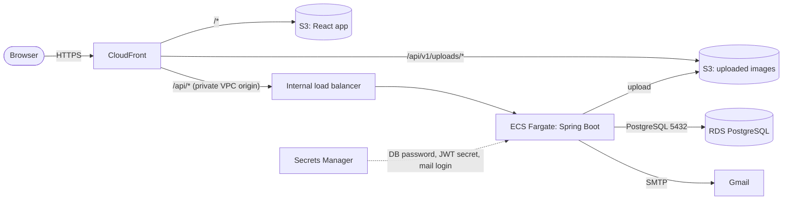
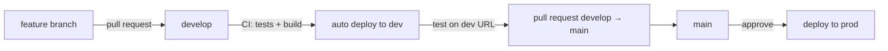

# Deploying Nexora to AWS

This guide sets up two environments, **dev** and **prod**, in AWS region **Europe (Stockholm) `eu-north-1`**, with automatic deployments from GitHub:

| Branch    | Deploys to | When                                              |
|-----------|------------|---------------------------------------------------|
| `develop` | dev        | Every push / merged pull request                  |
| `main`    | prod       | Every push / merged pull request, after approval  |

Everything in AWS is created from two CloudFormation templates in [`infra/`](../infra), so dev and prod are identical and can be rebuilt at any time.

---

## 1. What gets created



**Per environment** (`infra/environment.yml`, stacks `nexora-dev` and `nexora-prod`):

| Piece | What it does |
|---|---|
| CloudFront | The one public HTTPS address, e.g. `https://d1234abcd.cloudfront.net`. Serves the React app, forwards `/api/*` to the backend, serves uploaded images from S3. Because everything is on one address, the React code keeps calling `/api/v1/...` exactly as it does locally. |
| S3 bucket `nexora-<env>-frontend-<account>` | The built React app (`frontend/dist`). |
| S3 bucket `nexora-<env>-uploads-<account>` | Uploaded images, under `uploads/`. Private; only CloudFront can read, only the backend can write. |
| ECS Fargate service | Runs the Spring Boot Docker image. New versions start next to the old one and only take traffic once `/actuator/health` is healthy; a broken version is rolled back automatically. |
| Internal load balancer | Sends traffic to healthy backend containers. It has no public address; CloudFront reaches it privately. |
| RDS PostgreSQL | The database, in private subnets, reachable only from the backend containers. Automatic backups (7 days in prod). |
| Secrets Manager | Database password and JWT secret (both generated automatically) and the Gmail login. |
| CloudWatch Logs `/ecs/nexora-<env>-backend` | Spring Boot logs. |

**Shared** (`infra/shared.yml`, stack `nexora-shared`, created once):

| Piece | What it does |
|---|---|
| ECR repository `nexora-backend` | Stores backend Docker images, tagged `sha-<commit>`, plus `dev` / `prod` for the version currently running in each environment. |
| IAM role `nexora-github-deploy` | GitHub Actions signs in to AWS with this role through OIDC, so **no AWS access keys are stored in GitHub**. |

### How the database connection works
- The stack passes the RDS address to the container as `DB_URL` and the username/password from Secrets Manager as `DB_USERNAME` / `DB_PASSWORD` — the same variables `application.properties` already reads locally from `.env`.
- Hibernate (`ddl-auto=update`) creates and updates the tables when the backend starts, just like locally.
- The database only accepts connections from the backend's security group.

### How image uploads work
- Locally nothing changes: images are saved in `backend/uploads` and served by Spring.
- On AWS the stack sets `S3_BUCKET`, so `FileStorageService` saves each upload to `s3://nexora-<env>-uploads-<account>/uploads/<uuid>.<ext>` using the container's IAM role (no keys).
- The database still stores just the file name. The browser loads `/api/v1/uploads/<file>`, and CloudFront serves it straight from S3 with a one-year cache.

### How email links work
Verification and password-reset links use `FRONTEND_URL`. Locally that comes from `.env`; on AWS the stack sets it to the environment's CloudFront address.

### Rough monthly cost (per environment, light traffic)
| Item | ≈ USD / month |
|---|---|
| ECS Fargate, 1 container (0.5 vCPU, 1 GB) + public IPv4 | 20 |
| Application Load Balancer | 18 |
| RDS `db.t4g.micro` + 20 GB storage | 15 |
| CloudFront, S3, Secrets Manager, CloudWatch | 2–5 |
| **Total** | **≈ 55–60** (prod with 2 containers ≈ 75) |

Estimates only — check the [AWS Pricing Calculator](https://calculator.aws/) for your usage. See [Save money on dev](#save-money-on-dev).

---

## 2. One-time setup

Do the steps in this order. Steps 2–3 must happen **before** the first push, otherwise the first GitHub workflow run fails because the AWS role does not exist yet.

### Step 1 — Check the AWS region
In the AWS Console, the region selector (top right) must show **Europe (Stockholm)**. All stacks go in this region; the workflow uses `eu-north-1`.

### Step 2 — Create the shared stack
1. Open **CloudFormation** → **Create stack** → **With new resources (standard)**.
2. **Choose an existing template** → **Upload a template file** → choose `infra/shared.yml` → **Next**.
3. **Stack name:** `nexora-shared`
4. Parameters:
   - `GitHubRepository`: `nexoraentertainment18/nexora-web-App` (must match GitHub's capitalisation exactly).
   - `CreateGitHubOidcProvider`: `true`. Choose `false` only if **IAM → Identity providers** already lists `token.actions.githubusercontent.com`.
5. **Next** → leave options as they are → **Next**.
6. Tick **"I acknowledge that AWS CloudFormation might create IAM resources with custom names"** → **Submit**.
7. Wait for **CREATE_COMPLETE** (1–2 minutes). Open the **Outputs** tab and copy **`GitHubDeployRoleArn`**.

### Step 3 — Configure the GitHub repository
In GitHub, open the repository → **Settings**.

1. **Secrets and variables → Actions → Variables** tab → **New repository variable**
   - `AWS_DEPLOY_ROLE_ARN` = the `GitHubDeployRoleArn` from step 2.
2. **Secrets and variables → Actions → Secrets** tab → **New repository secret** (values from `frontend/.env`):
   - `VITE_TMDB_BEARER_TOKEN`
   - `VITE_OMDB_API_KEY`
3. **Environments → New environment** → name `dev`
   - **Deployment branches and tags** → **Selected branches and tags** → add `develop`.
4. **Environments → New environment** → name `prod`
   - **Required reviewers** → add yourself (and anyone else allowed to release) → **Save protection rules**.
   - **Deployment branches and tags** → **Selected branches and tags** → add `main`.

### Step 4 — Push the `develop` branch
```bash
git push -u origin develop
```
Open the **Actions** tab → **Deploy** run. It runs the tests, builds the backend image and pushes it to ECR as `nexora-backend:dev`. It finishes with the warning *"Stack nexora-dev does not exist yet"* — that is expected; the image has to exist before the stack can start the backend.

### Step 5 — Create the dev stack
1. **CloudFormation → Create stack → With new resources (standard)** → upload `infra/environment.yml` → **Next**.
2. **Stack name:** `nexora-dev`
3. Parameters:
   - `EnvName`: `dev`
   - `SharedStackName`: `nexora-shared`
   - `MailUsername` / `MailPassword`: the Gmail address and its [app password](https://myaccount.google.com/apppasswords) (the 16 letters, without spaces).
   - Sizing: keep the defaults.
4. **Next** → **Next** → tick the IAM acknowledgement → **Submit**.
5. Wait for **CREATE_COMPLETE**. This takes **20–40 minutes** (the database and CloudFront are the slow parts).
6. Open **Outputs** → **`AppUrl`** is the dev address.

### Step 6 — First real deploy to dev
**Actions → Deploy →** the run from step 4 → **Re-run all jobs**. This time it rolls out the backend and uploads the React app. When it is green, open `AppUrl` and sign up — the verification email link points at the dev address.

### Step 7 — Set up prod
1. On GitHub, open a pull request **`develop` → `main`** and merge it.
2. The **Deploy** run waits for approval: **Review deployments → prod → Approve and deploy**. It pushes `nexora-backend:prod` and warns that `nexora-prod` does not exist yet.
3. Create a stack exactly like step 5 but with:
   - **Stack name:** `nexora-prod`, `EnvName`: `prod`
   - `DesiredCount`: `2` (the API stays up if one container fails)
   - `VpcCidr`: `10.20.0.0/16` (optional, keeps the IP ranges of dev and prod distinct)
4. When it is **CREATE_COMPLETE**, re-run the Deploy run and approve it again. Prod is live at its own `AppUrl`.

---

## 3. Everyday workflow



1. Create a branch from `develop`, commit, open a pull request into `develop`. **CI** runs the backend tests (against a real PostgreSQL) and the frontend build; merge when green.
2. Merging deploys to **dev** automatically. Test on the dev address.
3. Open a pull request **`develop` → `main`**, merge, then approve the **prod** deployment in the Actions tab.

Each deploy: tests → build image → roll out on ECS (waits until healthy) → mark image as current → upload React app → clear CloudFront cache. If any step fails, later steps don't run, and a backend that fails its health checks is rolled back by ECS.

**Rolling back:** revert the bad commit and push, or open an older successful Deploy run and click **Re-run all jobs** (it redeploys that run's commit).

**Database changes:** Hibernate adds new tables and columns automatically, but it never renames or drops anything. Keep entity changes backwards compatible (add, don't rename), because for a minute during each deploy the old and new backend run side by side.

---

## 4. Operations

### Logs
**CloudWatch → Log groups → `/ecs/nexora-dev-backend`** (or `-prod`) → latest log stream. Deploy failures in GitHub Actions point here.

### Change the Gmail password (or other stack parameters)
1. **CloudFormation → `nexora-dev` → Update → Use existing template → Next**, change the value, finish the wizard.
2. **ECS → Clusters → `nexora-dev` → Services → `nexora-dev-backend` → Update service → tick Force new deployment → Update**, so containers pick up the new secret.

Changing the mail parameters regenerates that environment's JWT secret, which signs everybody out once.

### Update the infrastructure
Edit `infra/environment.yml`, then **Update** each stack with **Replace existing template** and upload the new file. Review the change set: anything that shows **Replacement: True** for `Database` would recreate the database — stop and double-check.

### Save money on dev
- Pause the backend: **Update** the `nexora-dev` stack with `DesiredCount` = `0` (set it back to `1` later).
- Stop the database: **RDS → Databases → `nexora-dev` → Actions → Stop temporarily** (AWS starts it again after 7 days).

### Delete an environment
1. For prod, first turn off **Deletion protection** on the RDS database (**Modify**).
2. **CloudFormation → stack → Delete**. A final database snapshot is kept.
3. The two S3 buckets are kept on purpose (they hold user uploads). Empty and delete them in S3 if you really want them gone — you must do this before creating a stack with the same name again.

### Add a custom domain later
Request a certificate in **ACM (region us-east-1)**, add the domain as an alternate domain name on the CloudFront distribution, and point DNS at CloudFront. Then set `FRONTEND_URL` to the new address (a small template change).

---

## 5. Troubleshooting

| Symptom | Fix |
|---|---|
| Workflow: `Not authorized to perform sts:AssumeRoleWithWebIdentity` | Check the `AWS_DEPLOY_ROLE_ARN` variable, that the environments are named exactly `dev` and `prod`, and that `GitHubRepository` in `nexora-shared` matches the repository name's capitalisation. |
| Shared stack fails: provider `token.actions.githubusercontent.com` already exists | Delete the failed stack and create it again with `CreateGitHubOidcProvider` = `false`. |
| Environment stack stuck or failed at `Service` | The image `nexora-backend:dev` (or `:prod`) was not in ECR yet — do step 4 first. Otherwise read the container logs in CloudWatch. |
| `Unable to assume the service linked role` on a brand-new AWS account | AWS creates that role on first use; delete the failed stack and create it again. |
| Deploy step: *"ECS rolled back to the previous version"* | The new backend didn't become healthy. The reason (database error, missing variable, exception) is in CloudWatch Logs. |
| `Invalid CORS request` from the API | Set `FRONTEND_URL`, `CORS_PRODUCTION_ORIGIN`, and `CORS_ALLOWED_ORIGINS` to the frontend's exact origin, including scheme and port (for example, `http://16.16.201.70:5173`), then restart/redeploy the backend. This CORS configuration applies to all API routes. |
| Verification emails don't arrive | Signup saves the pending account and allows the same address to retry sending. Check the backend logs for `Failed to send account verification email` to see the SMTP cause. On AWS, update the stack's `MailUsername` and `MailPassword` parameters; `MailPassword` must be a valid Gmail app password for that account (not its normal password), then deploy/restart the backend so ECS receives the updated secret. Check Gmail's Sent/blocked-mail activity and Google Account security if SMTP reports authentication errors. |
| App shows an old version after a deploy | Hard-refresh the browser. The deploy clears CloudFront's cache and `index.html` is never cached, so this is normally immediate. |

---

## 6. Files involved

| File | Purpose |
|---|---|
| `infra/shared.yml` | ECR repository and GitHub deploy role (stack `nexora-shared`). |
| `infra/environment.yml` | Everything for one environment (stacks `nexora-dev`, `nexora-prod`). |
| `.github/workflows/ci.yml` | Tests and build on pull requests; reused by the deploy workflow. |
| `.github/workflows/deploy.yml` | Deploys `develop` → dev and `main` → prod. |
| `backend/Dockerfile` | Builds the Spring Boot image. |
| `backend/src/main/resources/application-aws.properties` | Settings used only on AWS (quieter logging, graceful shutdown). |
